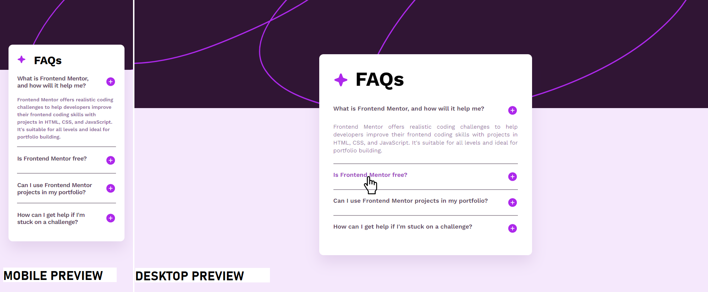

# Frontend Mentor - FAQ accordion

## Welcome! 👋

My challenge was to build out this **FAQ accordion** and make it look as close to the design as possible. I could use any tools I liked to help me complete the challenge.

## Table of contents

- [Overview](#overview)
  - [The challenge](#the-challenge)
  - [Screenshot](#screenshot)
  - [Links](#links)
- [Author](#author)

## Overview

### The challenge

Users should be able to:

- Hide/Show the answer to a question when the question is clicked
- Navigate the questions and hide/show answers using keyboard navigation alone
- View the optimal layout for the interface depending on their device’s screen size
- See hover and focus states for all interactive elements on the page

I ensured that my users could see hover and focus states for all interactive elements on the page

### Screenshot

### Links

- Solution URL: [GITHUB SOURCE](https://github.com/pettik/FrontendMentor--faq-accordion/)
- Live Site URL: [LIVE SITE 🌐](https://pettik-faq-accordion.netlify.app/)

## Author

- Website - [Petr Bednarski](https://github.com/pettik)
- Frontend Mentor - [@pettik](https://www.frontendmentor.io/profile/pettik)
